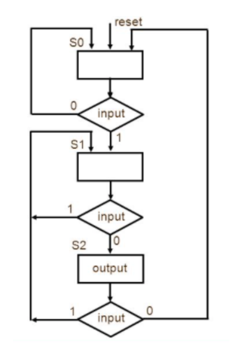
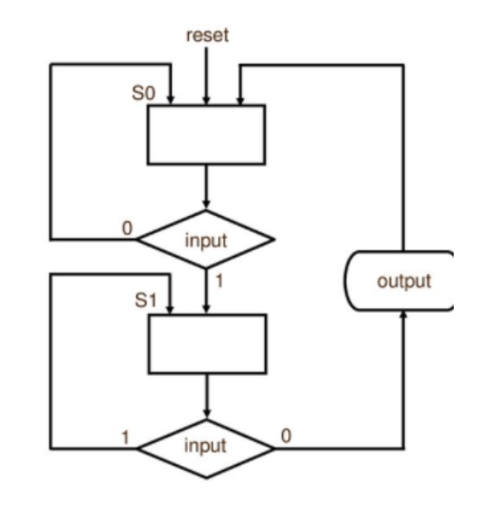

# Videos  
* [FSM and ASM](https://drive.google.com/file/d/1LJWyeFYUa1KHpaJcas1YV1BKros30512/view?usp=sharing)

# Textbook Summary
* Algorithmic State Machines (ASM charts)
  * ASM Charts are another way of describing FSMs
  * ASMs effectively work the same way as state diagrams, so typically it is user's preference on which design they would rather use.
  * ASMs differ by using squares as states or output signals, diamonds to represent an input, and sometimes an oval to represent an output.
  * These will also have the types Moore and Mealy.
 
# An example of a Moore Machine using ASM format.
  

# An example of a Mealy Machine using ASM format.
  

  Notice that the output is in an oval, this is usually a quick way to know that it is a Mealy Machine.
